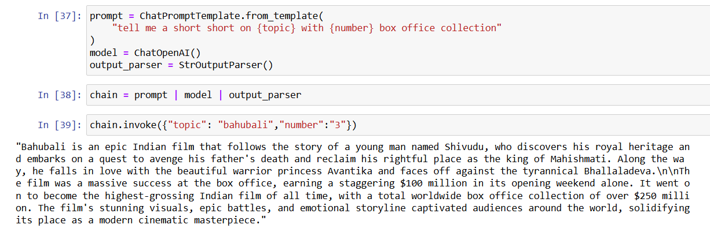
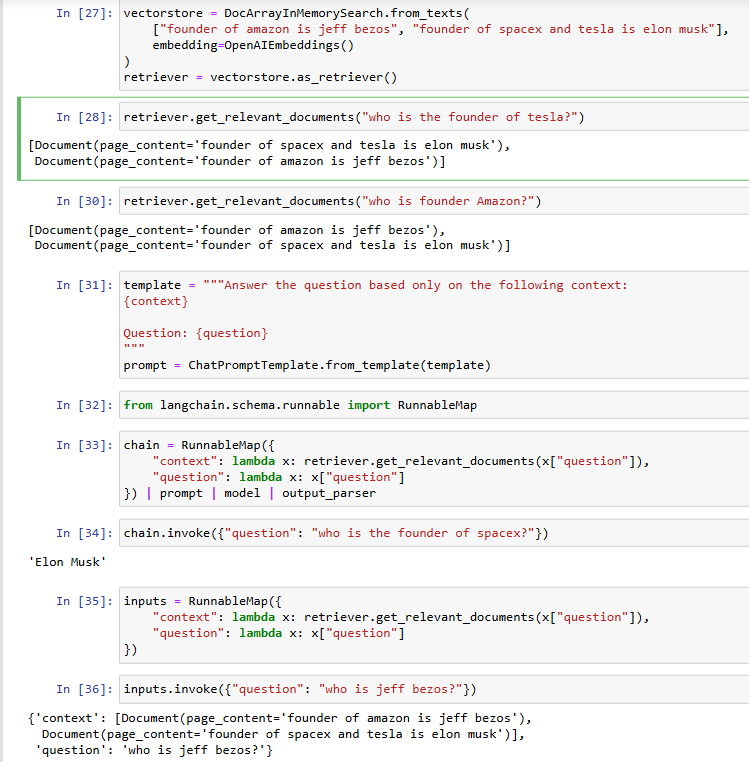

## Design and Implementation of LangChain Expression Language (LCEL) Expressions

### AIM:
To design and implement a LangChain Expression Language (LCEL) expression that utilizes at least two prompt parameters and three key components (prompt, model, and output parser), and to evaluate its functionality by analyzing relevant examples of its application in real-world scenarios.

### PROBLEM STATEMENT:
In this experiment we are implementing LangChain Expression Language with two prompt parameters and three key components, where we can generate the prompt output in 4-5 ways depending on the complexity of the prompt such as Simple Chain, More Complex Chain, Bind, Fallbacks, Interface and so on.In this experiment we have include SImple chain and More Complex Chain for better output results.

### DESIGN STEPS:

#### STEP 1:
Load necessary libraries like openai, langchain.prompts, and langchain.chat_models, and set the API key using dotenv. Create a ChatPromptTemplate, use ChatOpenAI for the model, and StrOutputParser for parsing the output. Chain components using the | operator, provide input, and execute the chain to generate a response.


#### STEP 2:
Create DocArrayInMemorySearch from a list of texts with OpenAIEmbeddings() and set up the retriever.  Use ChatPromptTemplate to combine the retrieved context and user-provided question into a single prompt.Map functions to fetch relevant documents and the question, then invoke the chain to generate a response.

### PROGRAM:
#### Simple Chain:
```
import os
import openai

from dotenv import load_dotenv, find_dotenv
_ = load_dotenv(find_dotenv()) # read local .env file
openai.api_key = os.environ['OPENAI_API_KEY']

from langchain.prompts import ChatPromptTemplate
from langchain.chat_models import ChatOpenAI
from langchain.schema.output_parser import StrOutputParser

prompt = ChatPromptTemplate.from_template(
    "tell me a short short on {topic} in {number} part "
)
model = ChatOpenAI()
output_parser = StrOutputParser()

chain = prompt | model | output_parser

chain.invoke({"topic": "bahubali","number":"3"})
```
#### More Complex Chain:
```
from langchain.embeddings import OpenAIEmbeddings
from langchain.vectorstores import DocArrayInMemorySearch

vectorstore = DocArrayInMemorySearch.from_texts(
    ["founder of amazon is jeff bezos", "founder of spacex and tesla is elon musk"],
    embedding=OpenAIEmbeddings()
)
retriever = vectorstore.as_retriever()

retriever.get_relevant_documents("who is the founder of tesla?")

retriever.get_relevant_documents("who is founder Amazon?")

template = """Answer the question based only on the following context:
{context}

Question: {question}
"""
prompt = ChatPromptTemplate.from_template(template)

from langchain.schema.runnable import RunnableMap

chain = RunnableMap({
    "context": lambda x: retriever.get_relevant_documents(x["question"]),
    "question": lambda x: x["question"]
}) | prompt | model | output_parser

chain.invoke({"question": "who is the founder of spacex?"})

inputs = RunnableMap({
    "context": lambda x: retriever.get_relevant_documents(x["question"]),
    "question": lambda x: x["question"]
})

inputs.invoke({"question": "who is jeff bezos?"})
```
### OUTPUT:
#### Simple Chain:



#### More Complex Chain:



### RESULT:
Thus, The implementation of a LangChain Expression Language (LCEL) is successfully executed.